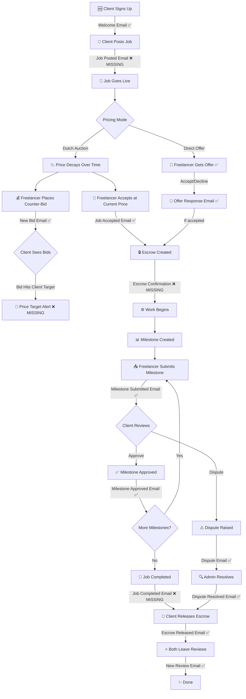

# GeekBid Email System — Complete Booking Flow Audit

## The Full Booking Lifecycle (State Machine)

## Current State: What's Hooked vs Missing

### ✅ Already Hooked (14 emails, all tracked with dedup)

| # | Email Function | Trigger Route | Who Gets It |
|---|---|---|---|
| 1 | `sendWelcomeEmail` | `POST /api/auth` (register) | New user |
| 2 | `sendNewBidEmail` | `POST /api/bids` | Client (when freelancer bids) |
| 3 | `sendDirectOfferEmail` | *Defined but not hooked* | Freelancer (when client sends offer) |
| 4 | `sendOfferResponseEmail` | `PATCH /api/jobs/offer-response` | Client (when freelancer responds) |
| 5 | `sendJobAcceptedEmail` | `PATCH /api/jobs/[id]` | Client (freelancer accepts job) |
| 6 | `sendMilestoneSubmittedEmail` | `PATCH /api/milestones` (submit) | Client |
| 7 | `sendMilestoneApprovedEmail` | `PATCH /api/milestones` (approve) | Freelancer |
| 8 | `sendEscrowReleasedEmail` | `PATCH /api/transactions` (release) | Freelancer |
| 9 | `sendDisputeEmail` | `PATCH /api/transactions` (dispute) | Other party |
| 10 | `sendDisputeResolvedEmail` | `PATCH /api/disputes` | Raiser |
| 11 | `sendNewReviewEmail` | `POST /api/reviews` | Reviewee |
| 12 | `sendTeamInviteEmail` | `PATCH /api/teams` (invite) | Invited user |
| 13 | `sendReferralSignupEmail` | `POST /api/auth` (referral) | Referrer |
| 14 | `sendAssessmentPassedEmail` | `POST /api/assessments` | Freelancer |

### ❌ MISSING — Critical Booking Flow Gaps

| # | Missing Email | Where to Hook | Why It Matters |
|---|---|---|---|
| **15** | **Job Posted Confirmation** | `POST /api/jobs` | Client should get confirmation their job is live with pricing details |
| **16** | **Escrow Created / Payment Confirmation** | `PATCH /api/payments` (verify) | Client needs receipt after Razorpay payment clears |
| **17** | **Job Completed Summary** | When all milestones approved OR manual completion | Both parties need a project summary with financials |
| **18** | **Price Target Alert** | `POST /api/bids` (when bid ≤ client's target) | Client gets notified "A bid matched your budget!" |
| **19** | **Booking Confirmation (Freelancer)** | `PATCH /api/jobs/[id]` (accept) | Freelancer also needs confirmation THEY accepted — with escrow details |
| **20** | **Deadline Warning** | Cron / scheduled (not in API — discussed below) | "Your job expires in 6 hours" alert |

### ⚠️ Nice-to-Have (Future Scope)

| Email | Use Case | Implementation |
|---|---|---|
| Password Reset | User forgot password | Need password reset flow first |
| Weekly Activity Digest | Engagement loop | Needs cron/scheduler |
| Inactivity Nudge | "You haven't bid in 7 days" | Needs cron/scheduler |
| Milestone Reminder | "Client hasn't reviewed your milestone in 48h" | Needs cron/scheduler |

---

## Implementation Plan — 5 New Emails

### 1. Job Posted Confirmation (Client)
- **Trigger:** `POST /api/jobs` → after successful insert
- **To:** Client who posted
- **Content:** Job title, pricing mode, starting price, minimum price, deadline, category
- **Idempotency Key:** `job_posted:{jobId}`

### 2. Payment/Escrow Confirmation (Client)  
- **Trigger:** `PATCH /api/payments` → after verified payment
- **To:** Client who paid
- **Content:** Amount, currency, job title, transaction ID, escrow status
- **Idempotency Key:** `payment_confirmed:{transactionId}`

### 3. Booking Confirmation (Freelancer)
- **Trigger:** `PATCH /api/jobs/[id]` → after freelancer accepts
- **To:** Freelancer who accepted
- **Content:** Job title, agreed price, escrow held amount, client name, next steps
- **Idempotency Key:** `booking_confirmed:{jobId}:{freelancerId}`

### 4. Job Completed Summary (Both Parties)
- **Trigger:** `PATCH /api/transactions` → when escrow is released (signals job completion)
- **To:** Client who released escrow
- **Content:** Project title, total paid, platform fee, freelancer name, review prompt
- **Idempotency Key:** `job_completed_client:{transactionId}`

### 5. Price Target Alert (Client)
- **Trigger:** `POST /api/bids` → when a counter-bid is ≤ the job's minimumPrice * 1.1
- **To:** Client
- **Content:** "A bid close to your budget floor just came in!", bid amount, freelancer name
- **Idempotency Key:** `price_target:{jobId}:{bidId}`
